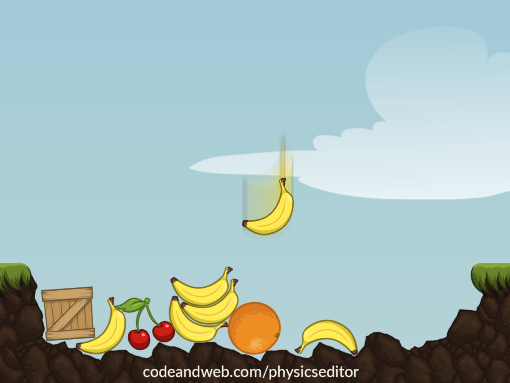

# Phaser 3 + MatterJS example

This respository contains the example source code for the [How to create physics shapes for Phaser 3 and Matter JS](https://www.codeandweb.com/physicseditor/tutorials/how-to-create-physics-shapes-for-phaser-3-and-matterjs) tutorial.

The tutorial explains:

* How to build a scene with Phaser 3 and MatterJS physics
* How to create simple collision shapes like rectangles and circles
* How to automatically create complex physics shapes

Screenshot of the example:

